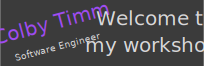
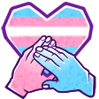
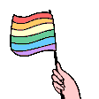

<a href="https://codeandsorts.com/">
  
</a>
<br/>
<br/>
<!-- https://readme-typing-svg.demolab.com/demo/?font=Atma&size=30&color=F73F9D&center=true&vCenter=true&width=480&lines=Curiously+crafting+code+and+systems;Tinkerer+and+maker;Championing+inclusion+through+every+step -->
<div align="center">
  <a href="https://git.io/typing-svg">
    
  </a>
</div>
<br/>
<br/>

&nbsp;&nbsp;Hey folks, welcome to my profile! My name is Colby Timm and I'm a full-stack software engineer based out of Vancouver, Canada.&nbsp;&nbsp;

<h1>&nbsp;&nbsp;Tools and Technology</h1>


<h1>&nbsp;&nbsp;About Me</h1>

```csharp
public class ColbyTimm
{
	public string Username { get; } = "colbytimm";

	public string Name { get; } = "Colby Timm";

	public string[] Pronouns { get; } = { "they", "them" };

	public string Blog { get; } = "https://www.codeandsorts.com";

	public string Position { get; } = "Architect, Full-Stack Software Engineer";

	public string Employer { get; } = "Slalom";

	public string Location { get; } = "Vancouver, Canada 🇨🇦";

	public string[] Interests { get; } = {
		"Cloud-native architecture",
		"Open source",
		"LLMs and prompt engineering",
		"Inclusive tech",
		"History & languages"
	};
	public string[] Roles { get; } = {
		"Developer",
		"Tinkerer",
		"ERG Organizer",
		"Facilitator",
		"Cat lover 🐈"
	};

	public string Tagline => "Curiously exploring tech with empathy.";

	public void SayHi()
	{
		Console.WriteLine("👋 Hi, I'm Colby! Let's build something awesome.");
	}
}
```

<br>

<div align="center" style="border: 2px solid #d1d5da; border-radius: 12px; padding: 1.5em; background: linear-gradient(135deg, #f5f5f5, #ffffff); box-shadow: 0 4px 10px rgba(0, 0, 0, 0.05); max-width: 600px; margin: 2em auto; font-family: sans-serif;">
  <div style="margin-bottom: 1em;">
    
    
  </div>
  <p style="font-size: 1.25em; font-weight: bold; color: #333; margin-bottom: 0.5em;">Equality Matters</p>
  <p style="font-size: 1em; color: #555; line-height: 1.6;">
    I believe all people are equal, deserving of dignity, respect, and opportunity—regardless of race, gender, identity, or background.<br />
    <strong style="color: #b4009e;">Trans rights are human rights</strong>, and inclusion isn’t optional.
  </p>
</div>

- &nbsp;&nbsp;I work at <a href="https://slalom.com">Slalom</a>
- &nbsp;&nbsp;I like to write blog articles for fun at  <a href="https://www.codeandsorts.com">Code and Sorts</a>
- &nbsp;&nbsp;My work GitHub is <a href="https://github.com/colby-timm">colby-timm</a>
- &nbsp;&nbsp;My LinkedIn <a href="https://www.linkedin.com/in/colbytimm">Colby Timm</a>
